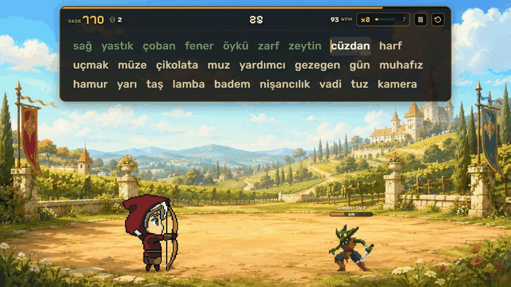
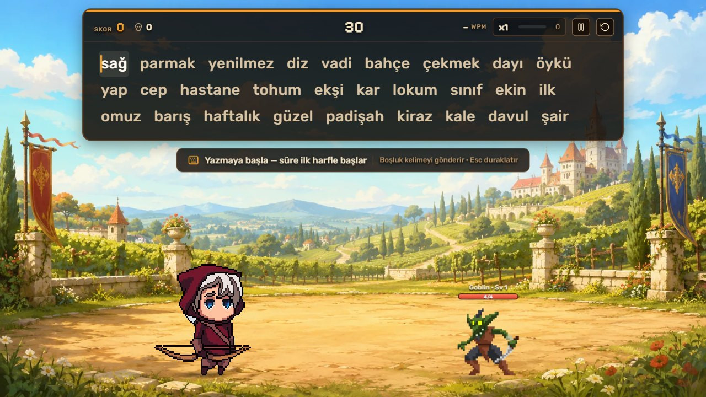
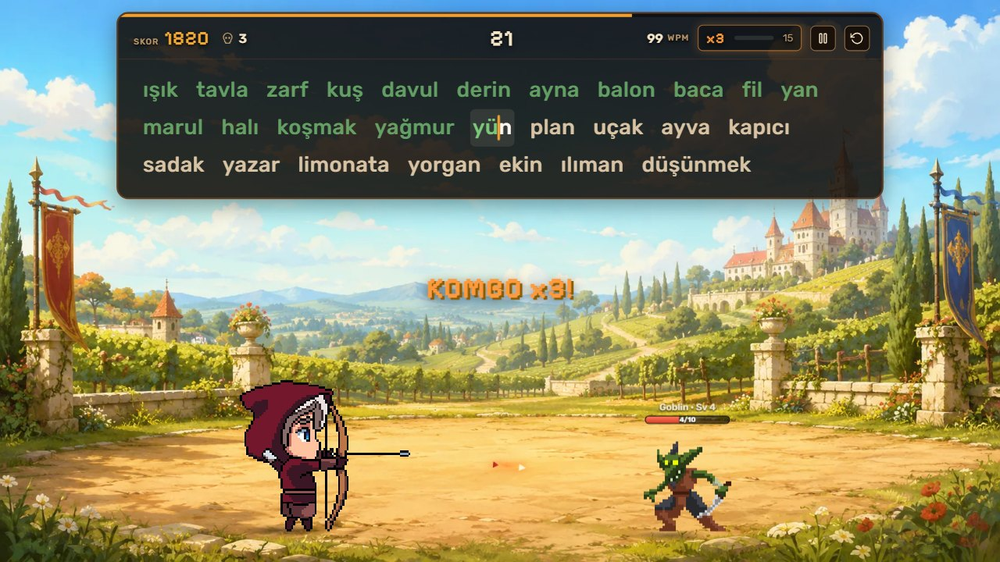
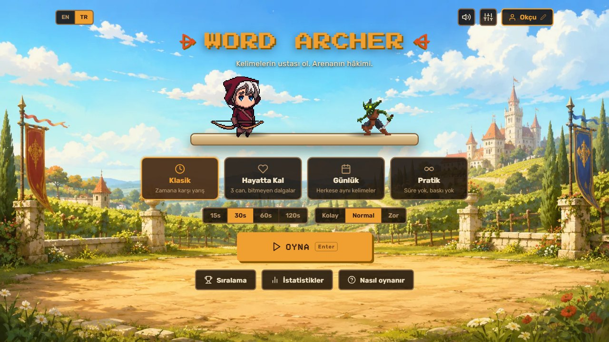
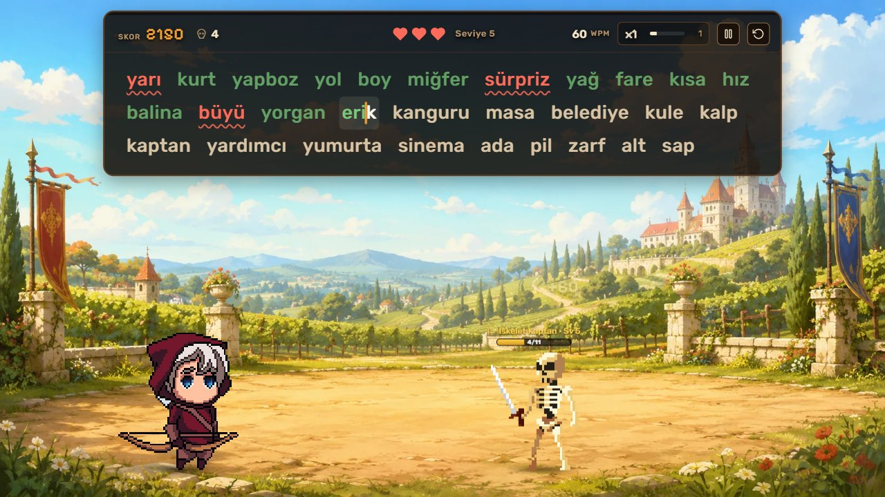
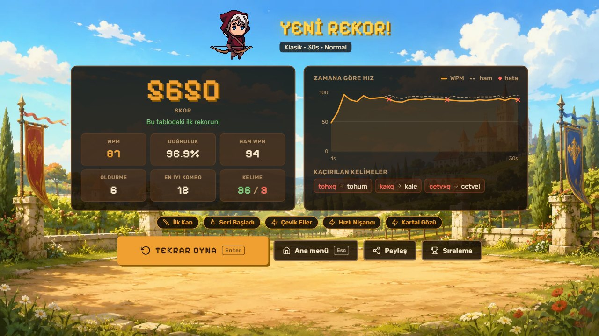
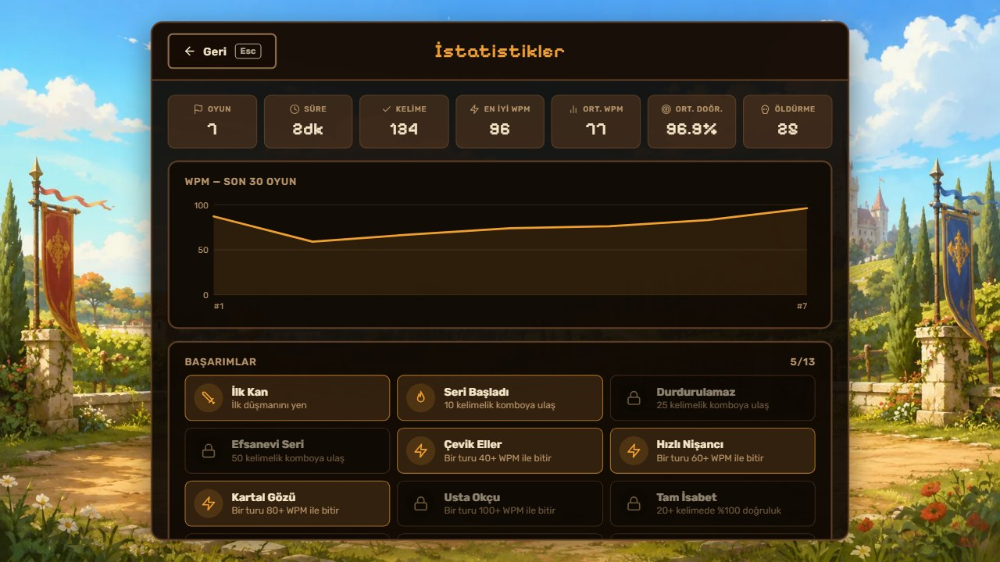
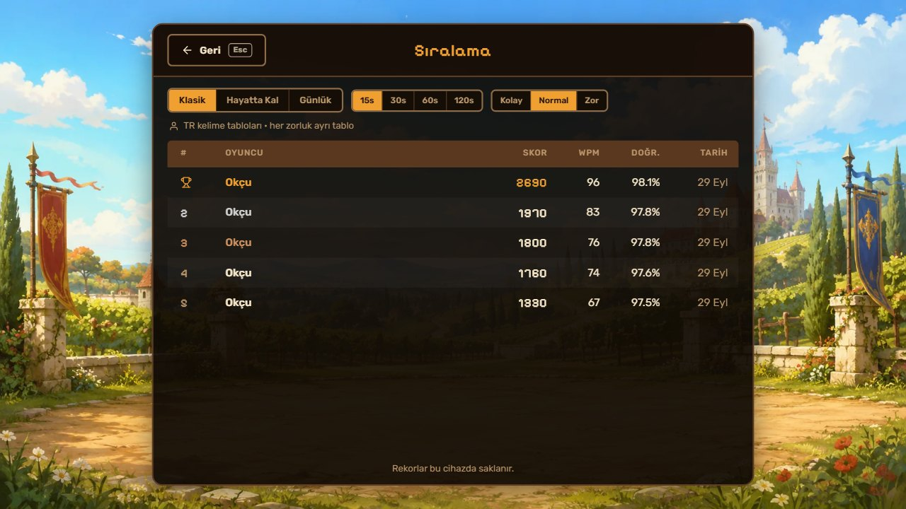
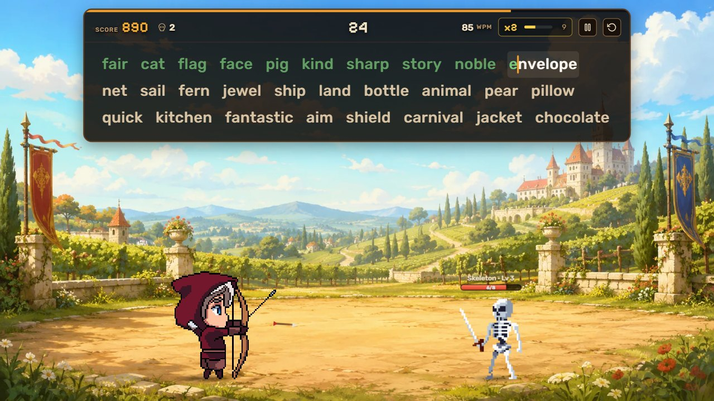

# 🏹 Word Archer

**Klavyen yayın, kelimelerin okun olsun.**

Kelimeleri doğru ve hızlı yaz, okçun her kelimede bir ok fırlatsın.
Goblinleri ve iskeletleri alt et, kombo yap, rekorunu kır.

<!-- Oyun yayına alındığında bu satırı aç ve adresi yaz:
### [▶ Hemen oyna](https://ornek-adres.com)
-->

*Tarayıcıda çalışır · Kurulum gerekmez · Türkçe ve İngilizce*

---

## 🎯 Word Archer nedir?

Word Archer, **klavye hızını eğlenceli bir şekilde geliştirmen** için tasarlanmış, piksel sanatlı küçük bir arena oyunu.

Ekranın üstünde kelimeler belirir. Sen yazdıkça aşağıdaki okçu karakterin karşısındaki düşmana ok atar.
Ne kadar hızlı ve hatasız yazarsan okların o kadar güçlü olur, düşmanlar o kadar çabuk düşer.

Sıkıcı yazma alıştırmaları yerine, her kelimenin bir hamle olduğu bir oyun.

---

## 🕹️ Nasıl oynanır?

1. **Yazmaya başla.** Süre ilk harfe bastığında başlar; acele etmene gerek yok.
2. **Kelimeyi bitirince Boşluk'a bas.** Doğru yazdıysan okçun ateş eder, yanlışsa ok boşa gider.
3. **Düşmanın can barını bitir.** Düşman yere serilince yerine daha güçlüsü gelir.

Yazarken harfler anında renklenir: **yeşil** doğru, **kırmızı** hatalı demek.
Hatalı harflerin altı ayrıca çizilir, böylece renkleri ayırt etmekte zorlanan oyuncular da hatayı rahatça görür.

---

## 🔥 Kombo: seri yaz, güçlen

Art arda doğru yazdığın her kelime komboyu büyütür:

| Art arda doğru kelime | Kombo | Ne olur? |
|:---:|:---:|---|
| 5 | **x2** | Oklar iki kat hasar verir, puanın ikiye katlanır |
| 15 | **x3** | 🔥 **Alevli oklar** devreye girer |
| 30 | **x4** | En yüksek güç: arena senin |

Tek bir hata komboyu sıfırlar, yani hız kadar **dikkat** de önemli.

---

## ⚔️ Oyun modları

<table>
<tr>
<td width="25%" align="center">⏱️ <b>Klasik</b></td>
<td width="25%" align="center">❤️ <b>Hayatta Kal</b></td>
<td width="25%" align="center">📅 <b>Günlük</b></td>
<td width="25%" align="center">♾️ <b>Pratik</b></td>
</tr>
<tr>
<td valign="top">15, 30, 60 ya da 120 saniye. Süre bitmeden olabildiğince çok puan topla.</td>
<td valign="top">3 canın var ve düşmanlar sana doğru yürüyor. Biri sana ulaşırsa bir can gider. Ne kadar dayanabilirsin?</td>
<td valign="top">Her gün yeni bir meydan okuma. O gün <b>herkese aynı kelimeler</b> gelir; arkadaşlarınla kıyasla!</td>
<td valign="top">Süre yok, baskı yok. Sadece rahatça pratik yap.</td>
</tr>
</table>

Klasik ve Hayatta Kal modlarında **Kolay**, **Normal** ve **Zor** olmak üzere üç zorluk seviyesi var.

Hayatta Kal modunda düşmanlar giderek hızlanır. Her 5. düşman altın renkli bir <b>İskelet Kaptan</b>dır ve daha dayanıklıdır.

---

## 🏆 Her turdan sonra

Tur bitince ne kadar iyi oynadığını bir bakışta görürsün:

- **Skorun** ve önceki rekorunla karşılaştırması
- **WPM** (dakikada kelime), yani yazma hızın
- **Doğruluk** yüzden
- Tur boyunca hızının nasıl değiştiğini gösteren **grafik**
- **Kaçırdığın kelimeler**; neyi yanlış yazdığını görüp bir dahakine dikkat edersin

Güzel bir skor mu yaptın? **Paylaş** butonuyla sonucunu arkadaşlarına gönder.

---

## 📈 Gelişimini takip et

<table>
<tr>
<td width="50%"></td>
<td width="50%"></td>
</tr>
<tr>
<td valign="top"><b>İstatistikler:</b> Kaç oyun oynadığın, en iyi hızın ve son oyunlardaki gelişimin tek ekranda.</td>
<td valign="top"><b>Rekorlar:</b> Her mod, süre ve zorluk için ayrı rekor tablosu.</td>
</tr>
</table>

Açılmayı bekleyen **13 başarım** var: *İlk Kan*, *Durdurulamaz*, *Usta Okçu*, *Tam İsabet*… Hepsini toplayabilecek misin?

---

## 🌍 Türkçe ve İngilizce

Oyun iki dilde oynanır; dil değişince kelimeler de değişir.
Her dilde **700'den fazla** kelime var. Kolaydan zora doğru ilerlerler, böylece tur ilerledikçe oyun da zorlaşır.

Türkçe'de `ı, ğ, ş, ç, ö, ü` harflerinin hepsi doğru tanınır.

---

## ⌨️ İşine yarayacak kısayollar

| Tuş | Ne yapar? |
|---|---|
| <kbd>Boşluk</kbd> | Kelimeyi gönderir |
| <kbd>Esc</kbd> | Oyunu duraklatır / devam ettirir |
| <kbd>Tab</kbd> + <kbd>Enter</kbd> | Turu hemen baştan başlatır |
| <kbd>Enter</kbd> | Menüde ve sonuç ekranında yeni tur başlatır |
| <kbd>Ctrl</kbd> + <kbd>⌫</kbd> | Yazdığın kelimeyi tamamen siler |

Başka bir sekmeye geçersen oyun **kendiliğinden duraklar**, geri döndüğünde kaldığın yerden devam edersin.

---

**Geliştirici misin?** Kurulum, yayına alma ve kod yapısı için 👉 [Geliştirici Rehberi](docs/GELISTIRICI.md)

Yapımcı: [asilturkmen.com](https://asilturkmen.com)

