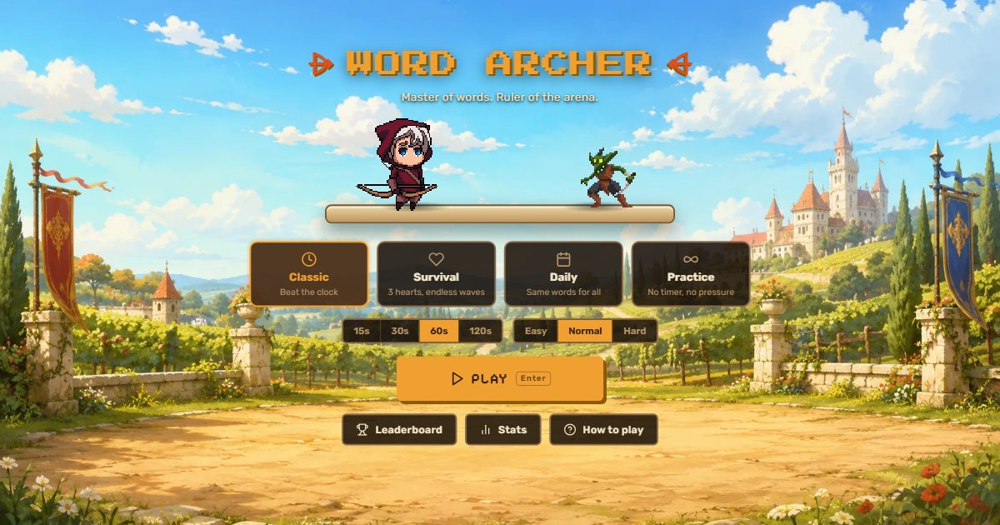

# 🏹 Word Archer

Piksel sanatlı, tarayıcıda çalışan bir **yazma (typing) oyunu**. Kelimeleri yaz, ok fırlat, kombo yap; goblin ve iskelet dalgalarını yen.
Türkçe ve İngilizce kelime havuzu, dört oyun modu, istatistikler, başarımlar ve (opsiyonel) global sıralama.



## Özellikler

- **4 mod**
  - **Klasik:** 15, 30, 60 ya da 120 saniyede olabildiğince çok puan topla.
  - **Hayatta Kal:** 3 canla oynarsın. Düşmanlar sana doğru yürür, biri ulaşırsa bir can gider.
  - **Günlük Meydan Okuma:** Herkes aynı gün aynı kelimeleri yazar (tohumlu rastgelelik).
  - **Pratik:** Süre ve baskı yok, sıralamaya sayılmaz.
- **Kombo sistemi:** 5 doğru kelimede x2, 15'te x3, 30'da x4 çarpan. Yüksek komboda hasar ve puan artar, x3'ten sonra alevli ok atılır.
- **Düşman dalgaları:** Her düşmanın can barı var. Her 5. düşman güçlü bir "kaptan"dır. Ölüm, vuruş ve saldırı animasyonları var.
- **Yazma deneyimi**
  - Süre ilk harfle başlar.
  - Kelimeler satır satır kayar.
  - Hatalı harfler hem renkle hem alt çizgiyle gösterilir (renk körlüğüne uygun).
  - Kısayollar: Boşluk kelimeyi gönderir, Ctrl+Backspace kelimeyi siler, Esc duraklatır, Tab+Enter hızlıca yeniden başlatır.
  - Sekme değişince ya da odak kaybolunca oyun otomatik duraklar.
- **Sonuç ekranı:** WPM, ham WPM, doğruluk, en iyi kombo, saniye bazlı hız grafiği, kaçırılan kelimeler, rekor karşılaştırması ve paylaş butonu.
- **İlerleme:** Kişisel rekorlar, istatistik ekranı (son 30 oyunun WPM trendi) ve 13 başarım.
- **Ses:** Tüm efektler WebAudio ile anında üretilir, ses dosyası gerekmez. Ses seviyesi ayarlanabilir, sessize alınabilir.
- **Erişilebilirlik:** "Hareketleri azalt" desteği (işletim sistemi ayarını izler), klavyeyle tam kullanım, modallarda odak yönetimi.
- **Türkçe doğru:** `I/ı` ve `İ/i` karşılaştırmaları Türkçe kurallarıyla yapılır.
- **Hafif:** Tek bağımlılık React. Toplam yaklaşık 80 KB gzip JS; arka plan 180 KB WebP.

## Hızlı başlangıç

```bash
npm install
npm run dev       # http://localhost:3000
npm test          # birim testleri (Vitest)
npm run build     # yayına hazır dosyalar -> dist/
npm run preview   # derlenmiş sürümü yerelde dene
```

Node 18 veya üstü gerekir.

## Yayına alma

`npm run build` sonrasında `dist/` klasörü tamamen statiktir; herhangi bir statik barındırıcıda çalışır. `base: './'` kullanıldığı için alt dizinde de sorunsuz açılır.

| Seçenek | Adımlar |
|---|---|
| **Netlify** | En hızlısı: `npm run build` → [app.netlify.com/drop](https://app.netlify.com/drop) sayfasına `dist/` klasörünü sürükle. Repo bağlarsan `netlify.toml` hazır. |
| **Vercel** | Repo'yu içe aktar. `vercel.json` hazır, ek ayar gerekmez. |
| **GitHub Pages** | Repo → Settings → Pages → Source: **GitHub Actions**. Sonra `main`'e her push'ta `.github/workflows/deploy-pages.yml` siteyi yayınlar. |

> **Open Graph görseli:** Sosyal medya önizlemesi için `index.html` içindeki `og:image` değerini tam adresle değiştir (ör. `https://alanadin.com/og-image.jpg`). Çoğu platform göreli yolu kabul etmez.

## Opsiyonel: Global sıralama (Supabase)

Env değişkenleri tanımlı değilse oyun **tamamen yerel** çalışır: rekorlar tarayıcıda saklanır, "Global" sekmesi görünmez.

1. [supabase.com](https://supabase.com) üzerinde ücretsiz bir proje aç.
2. **SQL Editor**'de `supabase/schema.sql` dosyasını çalıştır. Tablo, kısıtlar, RLS ve `top_scores` fonksiyonu oluşur.
3. **Project Settings → API** sayfasından URL'yi ve `anon` anahtarını al.
   - Yerelde: `.env.example` dosyasını `.env` olarak kopyala ve doldur.
   - Netlify/Vercel'de: aynı iki değişkeni ortam değişkeni olarak ekle.
   - GitHub Pages'te: Settings → Secrets and variables → Actions → **Variables** altına ekle.

```
VITE_SUPABASE_URL=https://xxxx.supabase.co
VITE_SUPABASE_ANON_KEY=eyJ...
```

> ⚠️ **Bilinen sınırlama:** Global sıralamada hesap sistemi yok; takma ad ile gönderilir. Sunucu makul olmayan değerleri (WPM > 250 vb.) reddeder ve her oyuncunun yalnızca en iyi skorunu gösterir. Ancak isteyen biri API'ye elle sahte skor gönderebilir. Hobi projesi için yeterli; ciddi rekabet istenirse Supabase Auth ve sunucu tarafı doğrulama eklenmeli.

## Proje yapısı

```
src/
  lib/
    engine.js        oyun motoru (saf JS; modlar, kombo, düşmanlar, zamanlayıcı, istatistik)
    words.js         tohumlanabilir kelime üretimi + zorluk rampası
    storage.js       localStorage (profil, ayarlar, geçmiş, rekorlar)
    achievements.js  başarım tanımları
    audio.js         WebAudio ses efektleri
    online.js        opsiyonel Supabase REST istemcisi
    sprite.js        sprite-sheet oynatıcı
    assets.js        asset yolları ve sprite tanımları
  screens/           Menü, Oyun, Sonuç, Sıralama, İstatistik, Ayarlar/Yardım
  components/        Sahne ölçekleme, ikonlar, modal/buton/toast, SVG grafik
  data/              words-en.js, words-tr.js (~700+ kelime/dil)
  i18n.js            TR / EN metinler
tests/               Vitest birim testleri
supabase/schema.sql  opsiyonel global sıralama şeması
```

## Görseller ve lisanslar

| Varlık | Kaynak | Lisans notu |
|---|---|---|
| Okçu | CraftPix.net | Oyunda kullanım serbest; ham dosyaların yeniden dağıtımı yasak. |
| Goblin | [LuizMelo — Monsters Creatures Fantasy](https://luizmelo.itch.io/monsters-creatures-fantasy) | CC0 |
| İskeletler | [MonoPixelArt — Skeletons Pack](https://monopixelart.itch.io/skeletons-pack) | Oyunda kullanım serbest; yeniden dağıtım ve satış yasak. |

Oyunda yalnızca kullanılan kareler `public/sprites/` altında bulunur. Ham asset paketleri (`wordassets/`) lisansları nedeniyle repoya dahil edilmez (`.gitignore`).

Yazı tipleri: Press Start 2P, Pixelify Sans, Rubik (Google Fonts, OFL).
